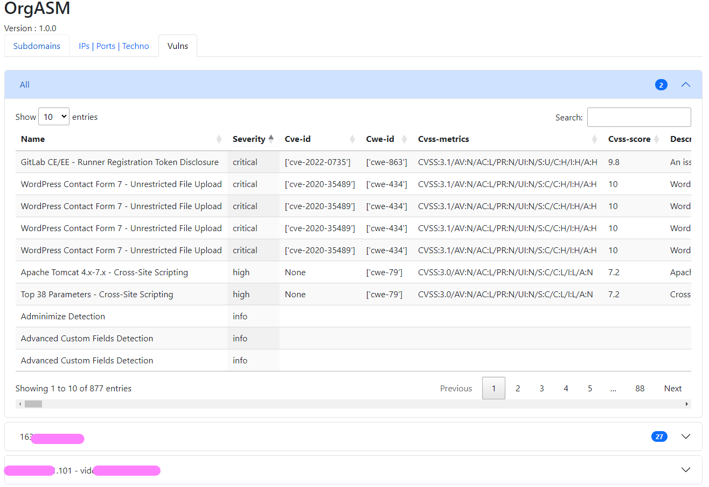
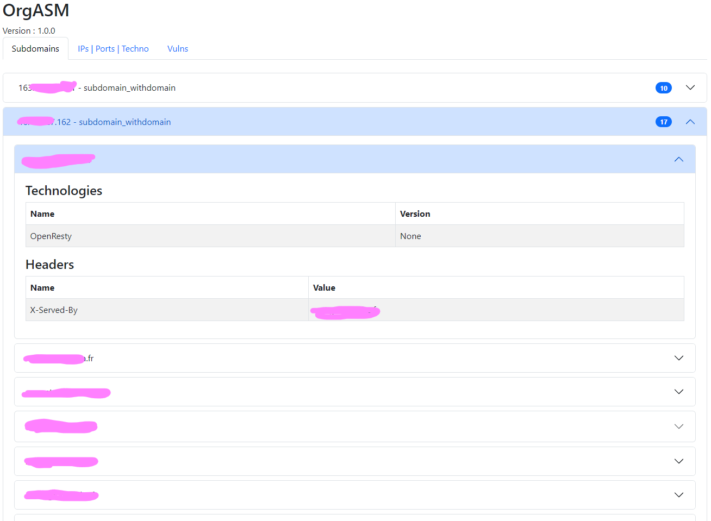
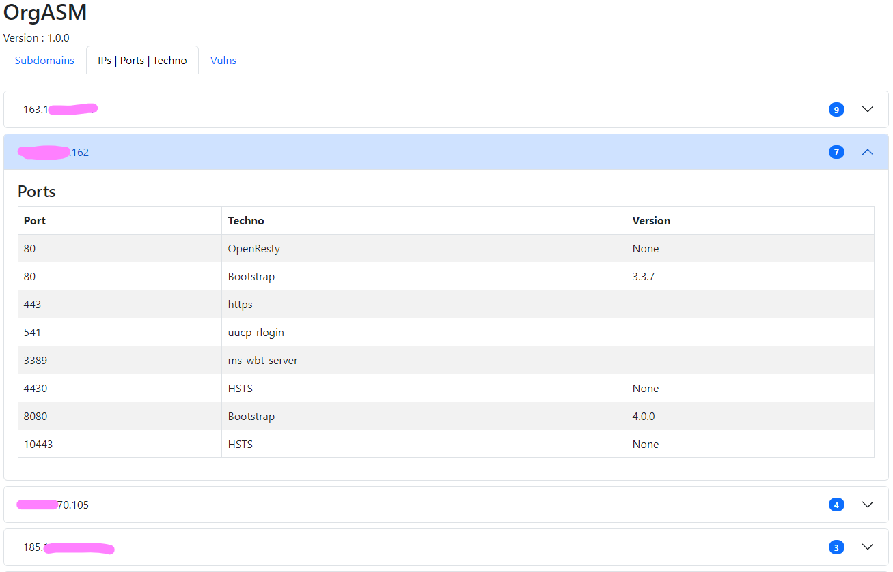

<p align="center"> </p>

[](https://github.com/ugomeguerditchian/OrgASM)


<h2 align="center">OrgASM</h2>

A tool for Organized ASM (Attack Surface Monitoring).

OrgASM can detect subdomains, detect all ip related to them, scan all open ports and detect services and vulnerabilities.

With the power of multi-threading it can be as fast as you want (and has you can) 🚀

In the very next future it will be shodan and censys friendly 🙌

We will also soon released the dorking compatibility and web parser 🥸

## Features

- Obtaining results via [Alienvault](https://otx.alienvault.com/), [Hackertarget](https://hackertarget.com/) and [crt.sh](https://crt.sh/)
- Web, JSON and TXT export
- Possibility to add a list of already knows subdomains
- Subdomain Bruteforcing
- Vulnerability detection with [nuclei](https://github.com/projectdiscovery/nuclei)
- Recursive scan
- IP Sorting and scanning (Ports and services)
- OrgASM can detect services using Wappalyzer sources ! Thanks to [webtech](https://github.com/ShielderSec/webtech)
- Harvesting of headers
- Filtering real subdomains by access them (and detect potential redirections to others subdomains).
- You can choose if you want only OSINT mode (API request on third party websites), Bruteforce and IPs scanning

## Installation

Install **OrgASM** with pip
(:warning: *Python 3.8 >= Needed*)

```
  git clone https://github.com/ugomeguerditchian/OrgASM
  cd OrgASM
  pip install -r requirements.txt
  usage: main.py [-h] [-d DOMAIN] [-m MODE] [-sF SUBFILE] [-R RECURSIVE] [-w WORDLIST] [-wT WORDLISTTHREADS]
               [-iS IPSCANTYPE] [-iT IPTHREADS] [-sT SUBDOMAINSTHREADS] [-cP CHECKPORTSTHREADS] [-dT DETECTTECHNO]
               [-vuln] [-vulnconf VULNCONFIG]

options:
  -h, --help            show this help message and exit
  -d DOMAIN, --domain DOMAIN
                        Domain to scan
  -m MODE, --mode MODE  Mode to use, O for OSINT (API request), B for bruteforce, S for IP scan (default OBS)
  -sF SUBFILE, --subfile SUBFILE
                        Path to file with subdomains, one per line
  -R RECURSIVE, --recursive RECURSIVE
                        Recursive scan, will rescan all the subdomains finds and go deeper as you want, default is 0
  -w WORDLIST, --wordlist WORDLIST
                        Wordlist to use (small, medium(default), big)
  -wT WORDLISTTHREADS, --wordlistThreads WORDLISTTHREADS
                        Number of threads to use for Wordlist(default 500)
  -iS IPSCANTYPE, --IPScanType IPSCANTYPE
                        Choose what IPs to scan (W: only subdomains IP containing domain given, WR: only subdomains IP
                        containtaining domain given but with a redirect, A: All subdomains detected
  -iT IPTHREADS, --IPthreads IPTHREADS
                        Number of threads to use for IP scan(default 2000)
  -sT SUBDOMAINSTHREADS, --subdomainsThreads SUBDOMAINSTHREADS
                        Number of threads to use for check real subdomains(default 500)
  -cP CHECKPORTSTHREADS, --checkPortsThreads CHECKPORTSTHREADS
                        Check all ports of subdomains for all IP in IPScantype (-iS) and try to access them to check
                        if it's a webport (default True) (deactivate with 0)
  -dT DETECTTECHNO, --detectTechno DETECTTECHNO
                        Detect techno used by subdomains (default True) (deactivate with False)
  -vuln, --vulnScan     Scan subdomains using Nuclei, you need to have nuclei installed and in your PATH (default
                        False)
  -vulnconf VULNCONFIG, --vulnConfig VULNCONFIG
                        Path to config file for nuclei (default is the default config)
```

> :memo: **Note:** help with `python main.py -h`

## Web Exports Exemple for the commands : python main.py -d domain.fr -vuln

Subdomains tab :


IPs | Ports | Techno tab :


Vulnerabilities tab :


## Roadmap

- [X] Service scanning amelioration
- [x] Added Web GUI !
- [ ] Add DNS transfer zone test
- [X] Recursive scan for subdomains bruteforcing
- [ ] Selection of others API websites like shodan, censys etc... (need to have an api key)
- [X] Filtering real subdomains by access them (and detect potential redirections to others subdomains)
- [ ] Dorking test
- [ ] Export map options
- [X] Possibility to add a list of already knows subdomains
- [X] Choice for doing only API scan, Bruteforce scan or IP scan (or all)
- [ ] Config file (yaml)
- [X] Choice for doing IP scan only on target associated with main domain
- [X] Add vulnerability scan
## Authors

- [@ugomeguerditchian](https://github.com/ugomeguerditchian)

## Contributors

- [@MrStaf](https://github.com/MrStaf)
