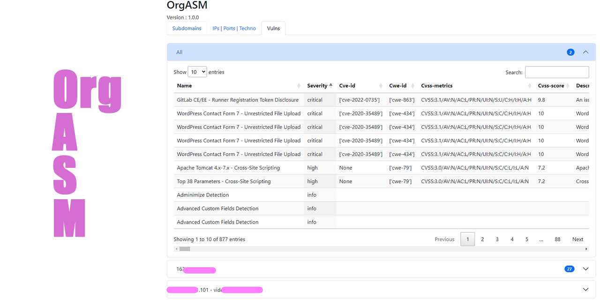

```

    ███████                         █████████    █████████  ██████   ██████
  ███░░░░░███                      ███░░░░░███  ███░░░░░███░░██████ ██████ 
 ███     ░░███ ████████   ███████ ░███    ░███ ░███    ░░░  ░███░█████░███ 
░███      ░███░░███░░███ ███░░███ ░███████████ ░░█████████  ░███░░███ ░███ 
░███      ░███ ░███ ░░░ ░███ ░███ ░███░░░░░███  ░░░░░░░░███ ░███ ░░░  ░███ 
░░███     ███  ░███     ░███ ░███ ░███    ░███  ███    ░███ ░███      ░███ 
 ░░░███████░   █████    ░░███████ █████   █████░░█████████  █████     █████
   ░░░░░░░    ░░░░░      ░░░░░███░░░░░   ░░░░░  ░░░░░░░░░  ░░░░░     ░░░░░ 
                         ███ ░███                                          
                        ░░██████        V3.1.0                            
                         ░░░░░░                                            
                                                     
```
# Organized Attack Surface Mapper


A tool for mapping the attack surface of any type of target, it can find **subdomains, IPs and ports, services** and then scan them with other tools like **nuclei**, ports scanner, service detector with wappalyzer, etc....

It has been designed to be **modular** and **easy to use**.
You can easily add your own **API** to find subdomains, and your own **tools** to run after the initial scan or **even during the Attack Surface discovery**.

It can also **pivot** to other related FQDNs and IPs. Last but not least, it features a **web export** with all the information found, and a ***modularity that makes it easy to add data from your tools***!

All is organized by a **configuration.yaml** file, here you can set all the settings of the initial scan and others tools.

<p align="center"> </p>


## Features 👀
* Discover Attack Surface
* Modularity on AS (Attack Surface) tools so you can add your own !
* Find subdomains related to domains
* Easy modularity on API to find new subs
* Easy configuration file
* Automatic update (and easy to add your own files to be updated)
* Find FQDN from an IP and find all associated subs
* Retreive all certificates of the IP and FQDNs founds and detect SAN
* Can pivot to others related FQDNs
* Can limit to a scope (regex(s), list, file)
* Pass traffic through proxies automatically fetched from public lists (you can add your own)
* Can launch others tools after initial scan completed
* Can resume a scan to the last tool used
* Modular web export for easy adding

## Installation 💾
**Need python3** 
```bash
git clone https://github.com/ugomeguerditchian/OrgASM
cd OrgASM
pip install -r requirements.txt
python main.py -h
```

## Implemented API for subs 🔭
* Alienvault
* Crt.sh
* Hackertarget
* Rapiddns
* AnubisDB
* Certspotter

## Implemented tools 🔧
* Bruteforce subdomains via wordlist and multiple resolvers
* Ports scanner
* Service detector
* Wappalayzer for detected web ports and FQDNs
* Nuclei scan

## Incoming tools 🔬
* Gobuster
* WafWoof

## Common usage 📖 
```
usage: main.py [-h] [-d DOMAIN] [-ip IP] [-net NETWORK] [-R RECURSIVE] [--resume RESUME]

options:
  -h, --help            show this help message and exit
  -d DOMAIN, --domain DOMAIN
                        Domain to scan
  -ip IP, --ip IP       IP to scan
  -net NETWORK, --network NETWORK
                        Network to scan, don't forget the CIDR (ex: 192.168.1.0/24)
  -R RECURSIVE, --recursive RECURSIVE
                        Recursive scan, will rescan all the subdomains finds and go deeper as you want, default is 0
  --resume RESUME       Resume a scan from the json export and to a tool (the last one to have finished), split with a ':' (ex: --resume exports/mydomain/date.json:nuclei) You   
                        can also use --resume exports/mydomain/date.json:export to just generate the html report

```

## Roadmap 🏎️
* More api
* Possibility to add your own jinja template for an html object inside the mapper of the tool

### Refer to Wiki for this :
* [Add new API for subs finding](https://github.com/ugomeguerditchian/OrgASM/wiki/Add-new-API-for-subs#getting-started)
* [Add new tools](https://github.com/ugomeguerditchian/OrgASM/wiki/Add-new-tool-to-run-after-initial-scan#getting-started)
* [Add new tools data to html report](https://github.com/ugomeguerditchian/OrgASM/wiki/Add-new-data-tool-to-the-html-export#getting-started)


## Contributing ❤️
We would love for you to contribute to OrgASM and help make it even better than it is today! 

You can easily add new API for subs, new tools to add with their data parser for the html report.

Here are the guidelines we'd like you to follow:

### **Issues**
If you find a bug in the project or want to propose a new feature, please submit an issue on our [GitHub Issues page](https://github.com/ugomeguerditchian/OrgASM/issues).

### **Pull Requests**
If you'd like to contribute code to this project you can do so through GitHub by forking the repository and sending a pull request. Here's how:

1. Fork the project via GitHub interface
2. Clone your fork to your machine.
3. Create a new branch with a meaningful name.
4. Make your changes and commit them to your branch.
5. Push your branch to your fork on GitHub.
6. Create a new pull request via GitHub interface, pointing to your fork and branch.
7. Fill in the required information and submit the pull request.

### **Coding Standards**
Please follow the coding conventions already established in the project. Consistency is key!

### **Code of Conduct**
In the interest of fostering an open and welcoming environment, we ask that our contributors adhere to a code of conduct which promotes respect and inclusivity. Harassment of any kind will not be tolerated.